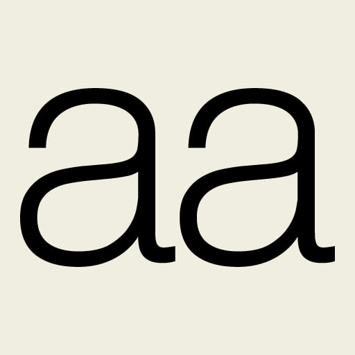
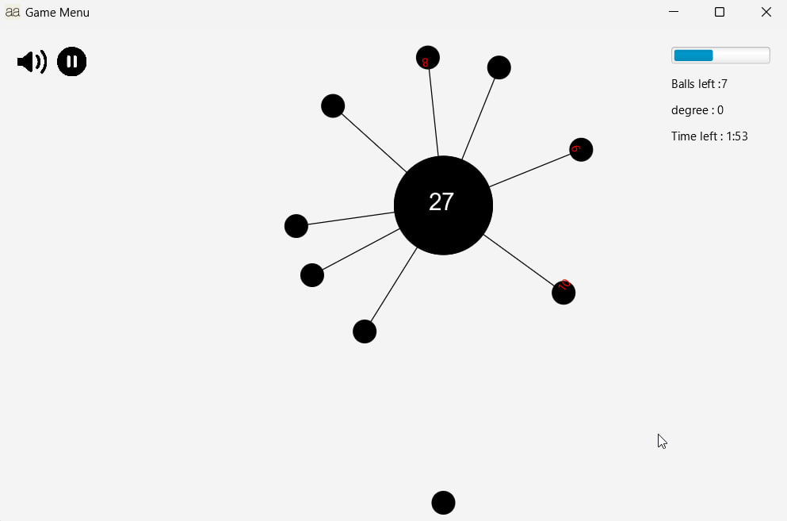

# aa-Game-Simulator

  
    

  

This project is a simplified implementation of the popular "aa" game. The objective is for players to launch balls onto a central rotating circle, ensuring no two balls collide. The game progresses through several challenging phases, each with increasing difficulty and unique gameplay mechanics.

  
    

 

## Features
### Single Player Mode
- Central Rotating Circle: Launch balls using the keyboard and aim to place them strategically to avoid collisions.
- Difficulty Levels: Adjust rotation speed, ball counts, and varying central circle layouts.
- Game Phases: The game intensifies through four progressive phases with unique behaviors, such as random direction changes, oscillating ball sizes, visibility toggles, and angled throws.
### Menus and User Profiles
- User Accounts: Register or log in to save progress and customize profiles.
- Scoreboard: View top 10 high scores with completion times and difficulty settings.
- Settings: Customize game language, control buttons, difficulty level, and toggle sound and color modes.
- Avatar Customization: Choose avatars from preset images, or upload a custom image.
### Multiplayer Mode
- Two-Player Mode: Simultaneously play with a second player, each launching balls from opposite sides of the circle.
- Shared Abilities: Both players can trigger a "Freeze Mode" to slow rotation, adding a strategic element to avoid collisions.
### Visual and Audio Effects
- Animations and Sound Effects: Visual feedback for launching balls, collision animations, and different soundtracks.
- Dynamic Backgrounds: Color changes to indicate game outcomes and visual feedback.
### Scoring and Saving
- Real-time Score Display: Scores update as balls are placed successfully.
- Game Persistence: Save and resume game progress, high scores, and user profiles.
